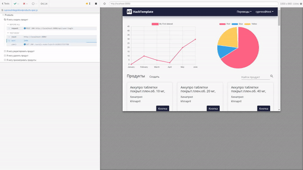

# AtomSkills
Описание нашей супер пупер навороченной информационной системы, ее предназначения, функционала.
________________
### Структура базы данных


________________
### Тестирование

Для запуска end to end тестирования необходимо запустить проект и выполнить следующую команду из дериктории frontend

 ```bash
 npm run cypress
 ```


________________
### Запуск системы

Для запуска системы необходимо наличие следующего ПО
- docker
- docker-compose
- make

Команды для сборки и запуска системы:
```bash
make build

make production
```
________________
### Какой-то старый хлам
npm cache clean --force

удаляем все остановленные контейнеры
docker rm $(docker ps -a -q)

удаляем все образы
docker rmi $(docker images -q)

запуск end to end тестирования
1. make start
2. создаем пользователя email: cypress@test password: 1
3. npm run cypress

Версия TSOA
"tsoa": "^2.3.8",

Оконные функции:
http://thisisdata.ru/blog/uchimsya-primenyat-okonnyye-funktsii/

